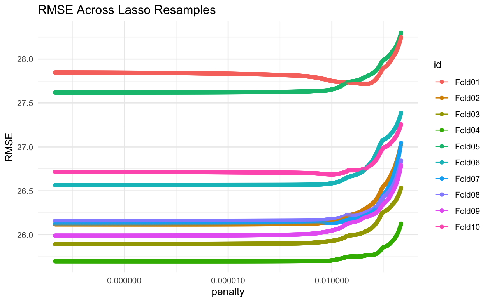
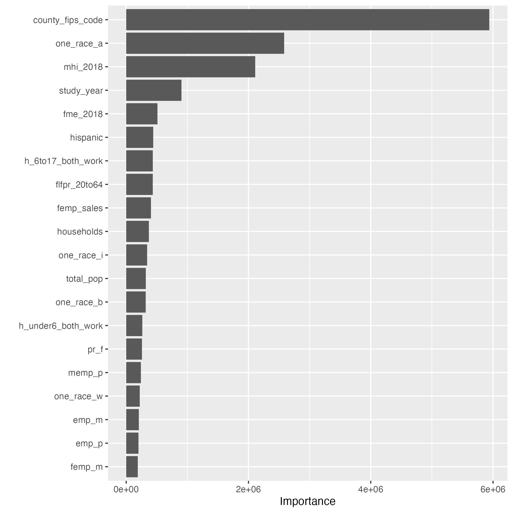

# Stretch02
Author: Zehui Li & Mujin Li
### Project Description

1. `penalized lasso model`:
{#fig-lasso_plot}
2. `random forest with hyperparameter tuning`:
{#fig-rf_plot}
3. `visualize the variable importance scores`:
{#fig-importance_score}

### Files Description

1. `Index.qmd`: contains all the code and serves as the main documentation.
2. `Index.html`: the web page or report generated by the project is displayed.
3. `Readme.md`: providing a brief introduction and project description
4. `marbles.csv`: includes the initial data to run the code.
5. `.gitignore`:specifies intentionally untracked files for Git 
6. `intuitive_model.png`: an easy-to-understand visual representation using the count function and ggplot.
7. `decision_tree.png`: a decision tree model plotted by rpart engine

### Reference

- [Tidy Modeling with R](https://www.tmwr.org/resampling)

- [tidytuesday: childcare costs](https://github.com/rfordatascience/tidytuesday/blob/master/data/2023/2023-05-09/readme.md)

- [Tidymodels: a predictive modeling case study](https://www.tidymodels.org/start/)

