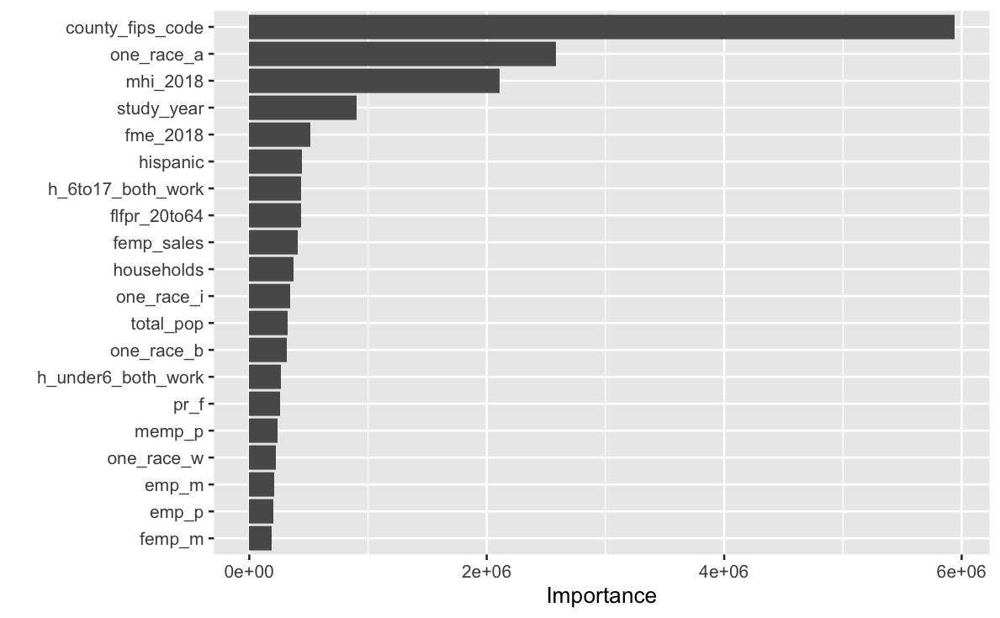

# Stretch02
Author: Zehui Li & Mujin Li

### Project Description

1. `penalized lasso model`:
{#fig-lasso_plot}

2. `random forest with hyperparameter tuning`:
{#fig-rf_plot}

3. `visualize the variable importance scores`:
{#fig-importance_score}

### Reference

- [Tidy Modeling with R](https://www.tmwr.org/resampling)

- [tidytuesday: childcare costs](https://github.com/rfordatascience/tidytuesday/blob/master/data/2023/2023-05-09/readme.md)

- [Tidymodels: a predictive modeling case study](https://www.tidymodels.org/start/)

