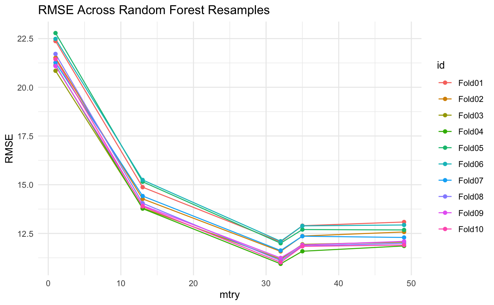

# Stretch02
Author: Zehui Li & Mujin Li
### Overview: Predicting Childcare Costs in a County
This repo is for McCourt Intro to Data Science class Stretch_02, which focus on machine learning contains 4 exercise.

The dataset we are utilizing is sourced from the [National Database of Childcare Prices (NDCP)](https://www.dol.gov/agencies/wb/topics/featured-childcare), which serves as a comprehensive federal repository of childcare pricing information at the county level. This dataset offers detailed insights into childcare costs, categorized by childcare provider type, children's age groups, and various county characteristics. Covering the period from 2008 to 2018, it encompasses a wide range of socio-economic variables pertinent to counties across the United States. It's worth noting that the initial data cleaning and acquisition processes were conducted as part of the Tidy Tuesday project, and you can find further details about the dataset [here](https://github.com/rfordatascience/tidytuesday/blob/master/data/2023/2023-05-09/readme.md).

The objective of this regression application is to build a predictive model that can estimate the median weekly cost of Center-Based Care for school-age children in a county based on various socio-economic and demographic features of that county. The outcome variable for this regression application is the median weekly cost of Center-Based Care for school-age children (`mcsa`). Center-Based Care refers to childcare provided in a daycare center or facility. Our predictor variables include:`unr_16`: Unemployment rate of the population aged 16 years old or older.`pr_f`: Poverty rate for families.`mhi_2018`: Median household income expressed in 2018 dollars.`total_pop`: Count of the total population etc.- 

- **Exercise 01: set up**
   - In this exercise, we perform Principal Component Analysis (PCA) on U.S. Senate Votes data from Session 103 to Session 114.
   - The key steps including:
     -  **Data Description and Prediction Application** 
     -  **Data Splitting** 
     -  **Exploratory Data Analysis (EDA)**
     -  **Error Metric and Costs**
   
- **Exercise 02: Models** 
   - Exercise 02 We have identified two different models for our prediction: LASSO, Random Forest.
   - The result are listed here:
     - 1. `penalized lasso model`:
{#fig-lasso_plot}

     - 2. `random forest with hyperparameter tuning`:
{#fig-rf_plot}

     - 3. `visualize the variable importance scores`:
{#fig-importance_score}

- **Exercise 03: Estimate** 
  - Implement one candidate model from step two on the training data with resampling methods and hyperparameter tuning (if applicable) using library(tidymodels).

- **Exercise 04: Interpretation** 
  - We employed Lasso Regression and Random Forest Regression, with RMSE as our evaluation metric.
After evaluating the model performances, we can draw the following conclusions: The Lasso Regression model achieved a lower RMSE of approximately 20, but the Random Forest Regression model obtained an even lower RMSE of around 10 compared to Lasso.
This indicates that the Random Forest model performed better, exhibiting better predictive accuracy in terms of childcare cost estimation.
While both models have their merits and can be valuable in practical applications, we observed a notable difference when examining the importance scores of individual features for each regression model.
In particular, the Random Forest model identified the county code as the most important feature, which suggests a potential risk of overfitting.
To address this concern, we decided to utilize the Lasso Regression model to select the top 5 features based on their importance.The top 5 features in lasso are`total_pop` (Total Population)`households` (Number of Households) `h_6to17_single_m` (Median Household Income for Households with Children Aged 6 to 17)`rhi_2018` (Racial and Ethnic Diversity Index in 2018) `h_under6_single_m` (Median Household Income for Households with Children Under 6 Years Old), See importance score picture above.
We will then incorporate these selected features into the Random Forest model.
This aims to combine the feature selection capability of Lasso with the predictive power of Random Forest, potentially leading to a more accurate prediction.
To imporve our model and reduce RMSE, several points can be considered.
Firstly, transitioning from county-level data to state-level data may lead to improved performance, though it entails significant effort and further learning.
Secondly, despite our optimization efforts, the final RMSE reduction was not substantial.
Lastly, we limited our feature selection to only five variables; increasing this count to ten could potentially yield better results.
These steps signify areas where additional exploration and refinement are needed to enhance our model's predictive accuracy.

### Reference

- [Tidy Modeling with R](https://www.tmwr.org/resampling)

- [tidytuesday: childcare costs](https://github.com/rfordatascience/tidytuesday/blob/master/data/2023/2023-05-09/readme.md)

- [Tidymodels: a predictive modeling case study](https://www.tidymodels.org/start/)

## Instructions:
1. Git clone the repo [Link](https://github.com/claregogo/Stretch02.git))
2. Install and load the packages: `tidyverse`, `tidymodels`, `recipes`, `dplyr`, `themis`, `ranger`, `vip`, `parsnip`, `ggplot2`, `readr`and `patchwork`.
3. Run the code in `index.qmd`

